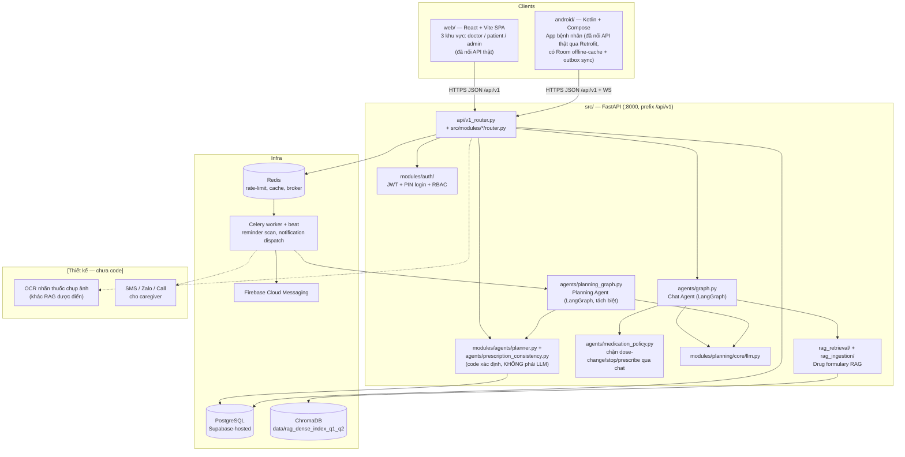
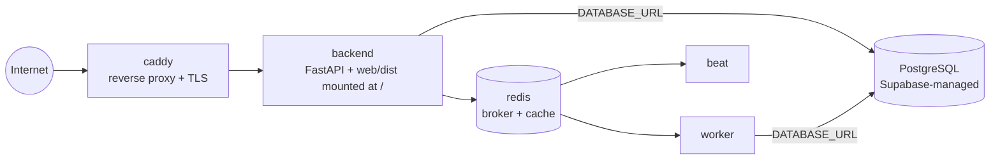

# Architecture Document — Dosely (VMEC-04)

> Tài liệu này mô tả kiến trúc **thật** của code hiện có trong repo, đối chiếu
> với kiến trúc **mục tiêu** đã chốt ở giai đoạn thiết kế (nguồn: tài liệu thiết kế ban đầu của dự án).
> Phần nào chưa code được đánh dấu **[Thiết kế — chưa code]** để không nhầm là
> đã triển khai. Ràng buộc bắt buộc khi sửa phần nào ở đây → đọc
> [CLAUDE.md](CLAUDE.md) trước.
>
> Cập nhật 2026-08-29: viết lại toàn bộ so với bản trước — bản cũ mô tả một
> snapshot MVP rất sớm (in-memory store, chưa có auth, chưa có Celery/Redis/RAG,
> Android còn mock data) không còn khớp code thật nữa.

## System Overview

Dosely là hệ thống nhắc thuốc & theo dõi tuân thủ điều trị cho bệnh nhân mạn
tính, mô hình **modular monolith**: một FastAPI backend (`src/`, tổ chức theo
vertical-slice module trong `src/modules/*`) phục vụ hai client — **Web Portal**
(`web/`, React + Vite, 3 khu vực theo role: doctor/patient/admin trong cùng 1
SPA) và **App bệnh nhân** (`android/`, Kotlin/Compose) — cộng hai LangGraph
riêng biệt: **Chat Agent** (`src/agents/graph.py`, trả lời bệnh nhân qua
`/chat`) và **Planning Agent** (`src/agents/planning_graph.py`, sinh lịch uống
thuốc từ đơn đã được bác sĩ duyệt). Nguyên tắc cốt lõi: **AI chỉ đề xuất,
validator bằng code xác định luôn là cổng cuối cùng trước khi persist** — xem
"Ràng buộc bất di bất dịch" trong CLAUDE.md.

**Trạng thái hiện tại:** đây không còn là MVP in-memory. Backend nối
**PostgreSQL thật** (hosted trên Supabase, `DATABASE_URL` trong `.env`) qua
Async SQLAlchemy 2.0 (`src/core/database.py`), có **JWT + PIN login + RBAC**
đầy đủ (`src/modules/auth/`), có **Redis + Celery worker/beat** thật
(`docker-compose.yml`), và có **RAG dược điển thật** (`src/rag_ingestion/`,
`src/rag_retrieval/`, index 11.6k đoạn OCR từ Dược thư Quốc gia). Cả Web Portal
lẫn App Android đều đã gọi API thật qua Retrofit/fetch, không còn mock data.
Phần còn thiếu so với kiến trúc mục tiêu: **OCR chụp ảnh nhãn thuốc** (khác với
RAG dược điển — xem Data Flow DF-06), **kênh SMS/Zalo/Call** cho caregiver
(alert hiện chỉ ghi DB + đẩy qua WebSocket, chưa gửi kênh ngoài), **multi-tenant**
và **MFA bác sĩ** — các điểm này còn mở, xem mục "Việc cần chốt" cuối file.

## Architecture Diagram



## Components

### 1. Web Portal (`web/`, React + Vite + TypeScript)
- **Trạng thái:** đã code, đã nối API thật (Vite dev proxy `/api` → `:8000`;
  production được `src/main.py` mount thẳng từ `web/dist/`).
- **3 khu vực theo role**, cùng 1 SPA (`web/src/pages/`):
  - `doctor/` — Dashboard tuân thủ (`KpiRow`, `PatientTable`, `PatientDrawer`),
    Kê/duyệt đơn (`PrescriptionView`), Cảnh báo (`AlertsView`), chi tiết bệnh
    nhân (`PatientDetailPage`).
  - `patient/` — Dashboard, lịch uống (`ScheduleView`, `DoseCard`), chat AI
    (`ChatView`), khảo sát (`SurveyView`), SOS (`SosView`), onboarding.
  - `admin/` — `AdminPortal.tsx` (quản lý tài khoản bác sĩ, audit log).
- **Ràng buộc UI bắt buộc giữ**: nút duyệt đơn phải gọi đúng chuỗi
  `POST /prescriptions` → `.../approve` → `.../schedules/generate`; lỗi 422 từ
  validator hiển thị nguyên văn issue; lịch `NEEDS_REVIEW` không được ẩn;
  không thêm nút sửa liều sau khi đơn đã `APPROVED`.

### 2. App bệnh nhân (`android/`, Kotlin + Jetpack Compose, Material3)
- **Trạng thái:** đã gọi backend thật qua Retrofit (`data/repository/Remote*RepositoryImpl.kt`
  gọi `DoselyApiService`), có Hilt DI (`di/{DatabaseModule,NetworkModule,
  RepositoryModule,ConnectivityModule,RealtimeModule}.kt`), có Room cache
  offline (`data/local/DoselyDatabase.kt` + `dao/`), có cơ chế **outbox**
  ghi hàng đợi khi mất mạng rồi replay qua WorkManager
  (`sync/OutboxSyncWorker.kt`, `sync/OutboxReplayer.kt` — xem
  `docs/outbox-replay-contract.md`), build/chạy/verify được trên emulator.
  Không còn mock data (`data/MockRepository.kt` đã bị xóa khỏi repo).
- **Việc còn thiếu** (xem `android/README.md`): push notification chưa
  deep-link thẳng vào `reminder/{doseId}` — màn Reminder hiện chỉ vào được
  bằng cách bấm từ dashboard; quyền `CALL_PHONE`/`ACCESS_FINE_LOCATION` cho
  SOS thật cần xác nhận lại.
- **Ràng buộc bắt buộc giữ:** đơn thuốc là read-only với bệnh nhân (chỉ bác sĩ
  duyệt), màn Reminder chỉ được báo taken/late/skipped — không được sửa
  dose/frequency/schedule trực tiếp từ client (xem `android/README.md` mục
  "Guardrails this UI must keep respecting").

### 3. Backend API (`src/api/` + `src/modules/*/router.py`, FastAPI)
- **Cấu trúc:** không có 1 file `routes.py` trung tâm — mỗi module dọc
  (`auth`, `admin`, `patients`, `prescriptions`, `agents`, `adherence`,
  `dashboard`) có `router.py` riêng, gộp lại ở `src/api/v1_router.py`. RESTful,
  prefix `/api/v1`, chi tiết đầy đủ ở `docs/api-contract.md` +
  `docs/api-reference.md`.
- **Authentication:** JWT (access + refresh) + đăng nhập bằng SĐT + PIN 6 số
  (`src/modules/auth/`), RBAC qua `require_roles(...)` theo role
  `PATIENT`/`DOCTOR`/`ADMIN`/`CAREGIVER` — **không phải OTP** như thiết kế rất
  sớm từng dự kiến.
- **Nhóm endpoint chính** (8 slice, xem `docs/api-contract.md`): Auth, Admin &
  Doctor Management, Doctor & Patient Clinical Management, Patient
  Profile/Routine/Caregiver, Prescriptions, Schedules & AI Agents (bao gồm
  `/chat`, `/chat/voice`), Adherence Logging & Safety Alerts, Realtime Events
  (`/ws/dashboard`, `/ws/patient`).

### 4. Chat Agent (`src/agents/graph.py`, LangGraph)
- **Vai trò:** trả lời chat bệnh nhân qua `/chat`/`/chat/voice` — **không phải
  free-form chatbot**, luôn qua `safety_guard_node` trước tiên (mọi lượt),
  sau đó `classify_intent_node` rẽ vào node chuyên biệt (`rescheduling`,
  `drug_rag`, `current_medications`, `next_dose`, `today_schedule`,
  `explain_my_medications`) hoặc vòng lặp ReAct tool-calling.
- **Guardrail nhiều lớp**:
  - Lớp 1+3: `safety_guard_node` — rule keyword (luôn thắng) + LLM classifier
    bổ sung (không được phủ quyết rule).
  - Lớp 2: `agents/medication_policy.py` — chặn xác định (không LLM) các yêu
    cầu đổi liều/ngừng thuốc/kê đơn/phối hợp thuốc qua chat.
  - Lớp 4: `rag_retrieval/input_guardrail.py` + `language_guardrail.py` — bắt
    buộc có tên thuốc trước khi retrieval, chặn ngôn ngữ ngoài whitelist.
  - Lớp 5: `agents/nodes/grounding_validator_node.py` — bắt buộc citation,
    chặn số liệu không có trong nguồn, chặn prompt injection.

### 5. Planning Agent (`src/agents/planning_graph.py`, LangGraph — tách biệt
với Chat Agent)
- **Trigger:** Celery task (`src/modules/agents/tasks.py`), không phải HTTP
  request trực tiếp — web/app gọi `POST /patients/{id}/schedules/generate`
  hoặc `.../reschedule`, backend trả `202 Accepted` + `agent_run_id` ngay,
  chạy nền, client poll `GET /agent-runs/{agent_run_id}`.
- **Pipeline node thật:** `planning_input_gate_node → planning_normalize_node
  → planning_generate_candidate_node` (LLM đề xuất gom nhóm giờ) `→
  planning_lock_and_revalidate_node` (code xác định revalidate lại toàn bộ,
  không tin LLM) `→ planning_apply_grouping_node → planning_persist_node →
  planning_audit_node`.
- **Guardrails bắt buộc** (đã áp dụng trong code):
  - Chỉ nhận prescription đã `status=APPROVED`.
  - Agent **không có quyền sửa** dose/frequency/route/treatment_duration —
    chỉ được sinh/dời khung giờ.
  - Mọi candidate phải qua `planning_lock_and_revalidate_node` (gọi
    `src/modules/agents/planner.py`, code xác định) trước khi persist.
  - Xung đột/thiếu dữ liệu không tự đoán → raise
    `PlanningNeedsReviewError` (và các subclass:
    `MissingRoutineAnchorError`, `ScheduleConstraintError`,
    `InvalidPrescriptionTimingError`, `FrequencyGuardrailError`), không tự
    tạo lịch.
  - Rescheduling **chỉ dời giờ**: `src/agents/nodes/rescheduling_node.py` chỉ
    trích xuất intent có cấu trúc rồi gọi tool `reschedule_remaining_doses`,
    không tự tính giờ tại chỗ (việc tính giờ luôn qua pipeline trên).

### 6. Deterministic Validator (`src/modules/agents/planner.py` +
`src/agents/prescription_consistency.py`)
- **Vai trò:** cổng kiểm tra cuối cùng bằng code (không LLM) trước khi bất kỳ
  lịch nào được persist — "Deterministic core, AI-assisted planning".
- `planner.py`: `validate_prescription_inputs()`, `validate_frequency_guardrails()`,
  `validate_candidate_boundaries()`, `reconcile_reschedule_candidates()`,
  `expand_schedule()` — hàm thuần, không DB/IO, test ở
  `tests/test_services/test_planner.py` + `test_schedule_planner.py`.
- `prescription_consistency.py`: `validate_prescription_schedule()` — đối
  chiếu lịch sinh ra với đơn thuốc gốc, đảm bảo không lệch field lâm sàng.
- Đơn thuốc là state machine đơn giản: `DRAFT → APPROVED` hoặc `DRAFT →
  CANCELLED` (`ck_prescriptions_status`, chỉ 3 trạng thái — không có
  `SUPERSEDED`/`ENDED` như một số bản thiết kế rất sớm từng phác thảo). Sửa
  item chỉ được phép khi đơn còn `DRAFT`.

### 7. Database (PostgreSQL, hosted trên Supabase)
- Async SQLAlchemy 2.0 (`src/core/database.py`), không còn in-memory store.
  Schema chi tiết field-by-field: `docs/schema.md`; 20+ bảng chính theo module
  (`users`, `patient_profiles`, `doctor_profiles`, `prescriptions`,
  `prescription_items`, `medications`, `scheduled_doses`, `adherence_logs`,
  `health_surveys`/`symptom_reports`, `alerts`, `agent_runs`, `audit_logs`,
  `caregiver_links`, `refresh_tokens`, `user_devices`...).
- Migration bằng Alembic (`alembic/versions/`, baseline `0001` tới các slice
  sau, xem `docs/structure.md`).

### 8. LLM Service (`src/modules/planning/core/llm.py`)
- `get_llm(...)` — wrapper `ChatOpenAI` (`langchain_openai`). **Chỉ dùng
  OpenAI**, không có provider nào khác được wire vào code (không Gemini).
  Dùng bởi cả Chat Agent (mục 4) và bước `planning_generate_candidate_node`
  của Planning Agent (mục 5) — output của cả hai luôn phải qua validator
  tương ứng, không được ghi thẳng.

### 9. Drug Formulary RAG (`src/rag_ingestion/`, `src/rag_retrieval/`)
- **Không có trong bản thiết kế/kiến trúc rất sớm — đã build thật.** Pipeline
  offline OCR + chunk + embed Dược thư Quốc gia (`docs/rag_ingestion_pipeline.md`) ra index thật tại `data/rag_dense_index_q1_q2/` (~11.6k
  đoạn, `text-embedding-3-large`, giữ local, không commit vào git).
- Retrieval thật: hybrid dense + BM25 (RRF-fused), qua tool
  `search_drug_formulary` + `src/agents/nodes/drug_rag_node.py`, được
  Chat Agent gọi khi bệnh nhân hỏi về thuốc — luôn qua Lớp 4/5 guardrail ở
  mục 4. **Chỉ tra cứu, không chẩn đoán hoặc tự tạo liều.**

## Data Flow

### DF-01/02 — Kê đơn & sinh lịch (đã implement)
```
Bác sĩ (web/, doctor portal) → POST /prescriptions (DRAFT, atomic với items)
             → POST /prescriptions/{id}/approve (APPROVED)
             → POST /patients/{id}/schedules/generate → 202 + agent_run_id
                  → Celery task → src/agents/planning_graph.py chạy Planning Agent
                  → planning_lock_and_revalidate_node gọi planner.py
                  → planning_persist_node ghi scheduled_doses
             → GET /agent-runs/{agent_run_id} (poll trạng thái)
             → GET /patients/{id}/schedules | GET /patients/me/schedules/today (hiển thị lịch)
```

### DF-03 — Nhắc & tuân thủ (đã implement)
Celery beat quét `scheduled_doses` sắp tới → tạo `notification_deliveries` →
gửi push qua FCM (`src/modules/adherence/fcm_service.py`,
`firebase-adminsdk.json`) → App/Web ghi nhận qua
`POST /scheduled-doses/{id}/actions` (hoặc `.../batch-actions` cho nhiều cữ
cùng lúc) với `Idempotency-Key` bắt buộc → `AdherenceLog` append-only. Quá hạn
không `TAKEN` → tính vào chuỗi missed-dose cho Red Alert (DF-05).

### DF-04 — Dời lịch (đã implement)
Bệnh nhân nói tự nhiên qua chat ("hôm nay tôi ăn trưa muộn") →
`rescheduling_node` extract intent có cấu trúc (structured output) → gọi tool
`reschedule_remaining_doses` → `POST /patients/{id}/schedules/reschedule` →
Planning Agent (mục 5) tính lại giờ — **agent tuyệt đối không tự tính giờ**,
chỉ dời trong ngày, không đổi dose/frequency/route/treatment_duration.

### DF-05 — Safety escalation (đã implement phần lõi, phần gửi caregiver ngoài kênh còn mở)
Trigger = rule-based keyword triệu chứng nặng (luôn thắng) HOẶC LLM bổ sung
(không phủ quyết được rule) HOẶC ≥3 lần SKIPPED/MISSED liên tiếp trong ngày
HOẶC bấm SOS → `trigger_red_alert` tạo `Alert OPEN`, đẩy real-time qua
`WS /ws/dashboard` (bác sĩ) và `WS /ws/patient` → bác sĩ
`acknowledge`/`resolve` qua `POST /alerts/{id}/...`. **[Thiết kế — chưa code]**:
gửi đa kênh (SMS/Zalo/Call) trực tiếp tới caregiver ngoài app — hiện alert chỉ
tới được người đang mở app/portal qua WebSocket.

### DF-06 — RAG dược điển (đã implement) vs. OCR nhãn thuốc (chưa code)
**Hai việc khác nhau, đừng nhầm:**
- RAG tra cứu Dược thư Quốc gia (mục 9) — **đã có thật**, phục vụ câu hỏi
  "thuốc X dùng để làm gì / tương tác với Y không" qua chat.
- OCR chụp ảnh nhãn thuốc bệnh nhân đang cầm → tra cứu → xác nhận — **chưa có
  code nào** (endpoint `POST /patients/{id}/drug-label-ocr` từng phác thảo đã
  bị bỏ khỏi contract, xem `docs/api-contract.md`). Không dùng RAG dược điển
  để tự chẩn đoán ảnh nhãn thuốc khi nào phần này được build.

## Deployment Architecture

**Hiện tại:** `docker-compose.yml` chạy 5 service: `backend` (FastAPI,
`web/dist/` được `src/main.py` mount thẳng vào `/` nên 1 container có cả UI +
API), `redis` (rate-limit, cache, Celery broker), `worker` (Celery worker —
OCR/RAG/notification bất đồng bộ), `beat` (Celery beat — quét missed-dose
định kỳ), `caddy` (reverse proxy, tự cấp/gia hạn HTTPS qua Let's Encrypt).
**Database KHÔNG chạy trong compose** — trỏ thẳng ra PostgreSQL managed trên
Supabase qua `DATABASE_URL` trong `.env`.



**Mục tiêu [Thiết kế — chưa code]** (docs mục 7.8): staging/production tách
biệt rõ ràng hơn (hiện chỉ có 1 VPS chạy compose ở trên), canary/rolling
deploy, agent prompt/graph có version + golden test cases.

## Security & Guardrails

Các
điểm đã áp dụng trong code hiện tại:

| Rủi ro | Kiểm soát hiện có |
|---|---|
| Agent tự sửa phác đồ | Không tool nào ghi `prescriptions`/`prescription_items`; `planner.py` + `prescription_consistency.py` chặn trước persist |
| Agent tự kê đơn/đổi liều/ngừng thuốc qua chat | `agents/medication_policy.py` — chặn xác định bằng code, không phải prompt |
| Agent bịa lịch khi thiếu dữ liệu | `planning_input_gate_node`/`planning_lock_and_revalidate_node` raise `PlanningNeedsReviewError`, không tự đoán |
| Agent tự đánh dấu đã uống thuốc (prompt injection) | ⚠️ **Chưa được chặn** — `record_dose_action` hiện LÀ tool LLM thật (đổi quyết định có chủ đích so với plan gốc, xem `docs/cong_viec.md` §2.3). Rủi ro injection vẫn còn nguyên, chưa có mitigation thay thế |
| Sửa đơn sau khi duyệt | State machine `Prescription`: `DRAFT → APPROVED\|CANCELLED`, item chỉ sửa được khi còn `DRAFT` |
| Trả lời sai thông tin thuốc/bịa nguồn | `grounding_validator_node.py` — bắt buộc citation, chặn số liệu ngoài nguồn, retry 1 lần rồi fallback cố định |
| Triệu chứng nguy hiểm bị bỏ sót | `safety_guard_node` — rule-based luôn thắng, LLM chỉ bổ sung không phủ quyết, fail-open khi lỗi/timeout |

Các điểm **[Thiết kế — chưa code]**: OCR nhãn thuốc + allowlist, redaction log
PII/PHI, gửi cảnh báo đa kênh (SMS/Zalo/Call) ngoài WebSocket, MFA bác sĩ,
multi-tenant. **Không log plaintext OTP/token/PHI** (ràng buộc bất di bất
dịch, CLAUDE.md) áp dụng ngay cả với code hiện tại.

## Design Decisions

| Decision | Choice | Lý do |
|---|---|---|
| Backend framework | FastAPI | Async, auto-docs, type-safe qua Pydantic |
| Kiến trúc backend | Vertical-slice modules (`src/modules/*`), không 1 file route trung tâm | Mỗi module tự chứa models/schemas/repository/service/router; không import chéo `service.py` giữa các module |
| Agent orchestration | LangGraph, **2 graph tách biệt** (chat vs planning) | State machine có kiểm soát, không phải free-form chat — bắt buộc cho guardrail HITL; tách graph để lỗi ở chat không ảnh hưởng pipeline tính lịch |
| Validator | Code xác định, tách khỏi agent (`planner.py`, `prescription_consistency.py`, `medication_policy.py`) | "Deterministic core, AI-assisted planning" — LLM không được là cổng an toàn cuối |
| LLM provider | Chỉ OpenAI (`langchain_openai.ChatOpenAI`) | Đơn giản hoá tích hợp, không cần abstraction đa provider ở MVP |
| Mô hình hệ thống | Modular monolith (không microservices) | Giảm độ phức tạp vận hành ở MVP, có đường tách khi tải tăng |
| Database | PostgreSQL managed trên Supabase (không tự host) | Giảm gánh vận hành DB, có sẵn backup/scaling cơ bản cho giai đoạn demo |
| Async jobs | Celery + Redis (worker + beat riêng biệt) | Tách xử lý nền (nhắc thuốc, tính lịch) khỏi request/response chính |
| Drug RAG | Dense (embedding) + BM25 hybrid, RRF-fused, tự host trên ChromaDB | Không phụ thuộc vector DB SaaS; kiểm soát được nguồn/citation cho tra cứu y tế |
| Android client | Native Kotlin + Compose (không React Native/Flutter) | Theo `docs/Android_Compose_System_Design_Skills.md` + skill `android-development` |
| Web client | React + Vite (không Next.js) | `web/` build tĩnh, FastAPI mount trực tiếp — không cần Node server riêng khi deploy |
| Reverse proxy | Caddy | Tự động cấp/gia hạn HTTPS (Let's Encrypt) không cần cấu hình thủ công |

## Việc cần chốt trước khi code tiếp (mở, xem CLAUDE.md & docs mục 7.10/13)

Ngưỡng bỏ thuốc 3 hay >3 lần (D-01), nhà cung cấp SMS/Zalo/Call (D-02),
caregiver có tài khoản riêng hay chỉ là contact (D-03), MFA bác sĩ (D-04),
multi-tenant — **nếu code đụng vào các điểm này, hỏi lại thay vì tự quyết**
(CLAUDE.md). Ngoài ra: `record_dose_action` đang là tool LLM thật dù rủi ro
prompt-injection chưa có mitigation (xem bảng Security & Guardrails) — nên
được xem lại như một quyết định riêng, không phải một phần của 4 điểm D-01…D-04
ở trên.
