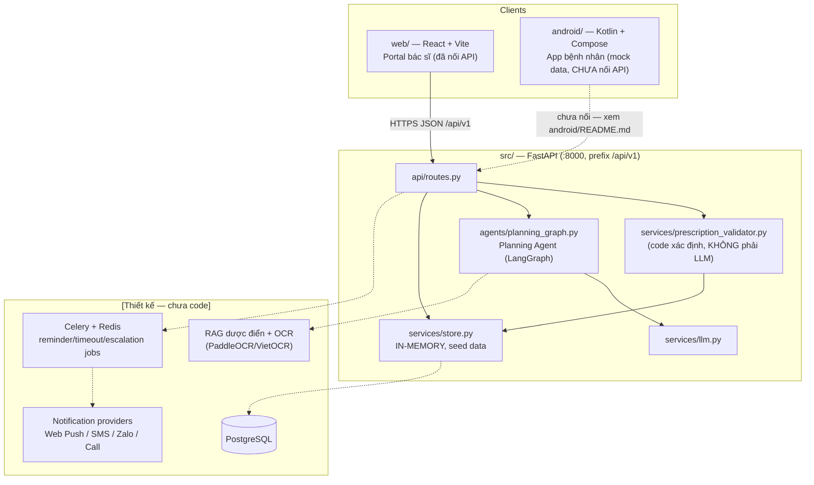
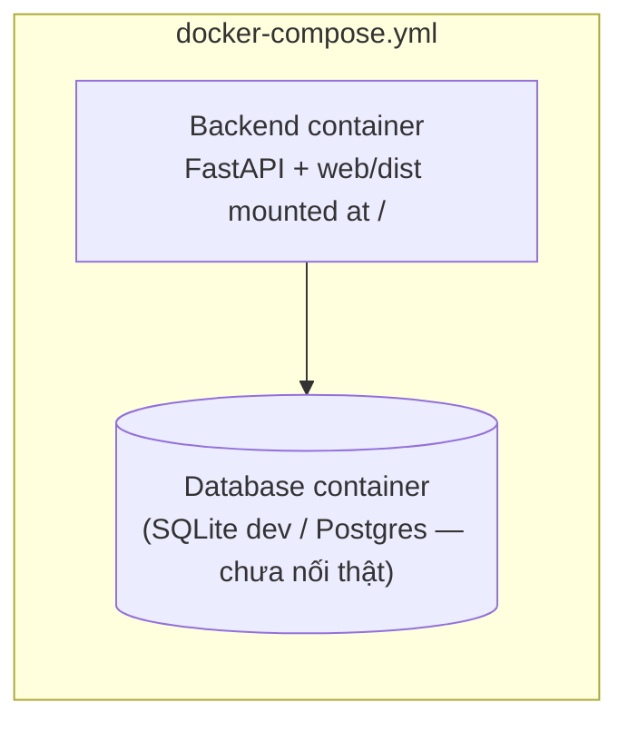

# Architecture Document — RemindRx (P-216 / VMEC-04)

> Tài liệu này mô tả kiến trúc **thật** của code hiện có trong repo, đối chiếu
> với kiến trúc **mục tiêu** đã chốt ở giai đoạn thiết kế (nguồn:
> [docs/RemindRx_Tong_Hop_Tai_Lieu.md](docs/RemindRx_Tong_Hop_Tai_Lieu.md) mục 6–7).
> Phần nào chưa code được đánh dấu **[Thiết kế — chưa code]** để không nhầm là
> đã triển khai. Ràng buộc bắt buộc khi sửa phần nào ở đây → đọc
> [CLAUDE.md](CLAUDE.md) trước.

## System Overview

RemindRx là hệ thống nhắc thuốc & theo dõi tuân thủ điều trị cho bệnh nhân mạn
tính, mô hình **modular monolith**: một FastAPI backend (`src/`) phục vụ hai
client — **Portal bác sĩ** (`web/`, React) và **App bệnh nhân** (`android/`,
Kotlin/Compose) — cùng một **Planning Agent** chạy trên LangGraph để sinh lịch
uống thuốc từ đơn đã được bác sĩ duyệt. Nguyên tắc cốt lõi: **AI chỉ đề xuất,
validator bằng code xác định luôn là cổng cuối cùng trước khi persist** — xem
"Ràng buộc bất di bất dịch" trong CLAUDE.md.

**Trạng thái hiện tại (MVP):** backend chạy với **in-memory store** có seed data
(`src/services/store.py`), chưa nối PostgreSQL thật dù `DATABASE_URL` đã có
trong `Settings`. Portal bác sĩ đã nối API thật. App Android mới là scaffold
UI với **mock data**, chưa gọi `src/api/routes.py`. Không có Celery/Redis, OCR,
RAG, hay kênh SMS/Zalo/Call — các phần này thuộc kiến trúc mục tiêu, chưa code.

## Architecture Diagram



## Components

### 1. Portal bác sĩ (`web/`, React + Vite + TypeScript)
- **Trạng thái:** đã code, đã nối API thật (Vite dev proxy `/api` → `:8000`;
  production được `src/main.py` mount thẳng từ `web/dist/`).
- **Màn hình:** Dashboard tuân thủ (`KpiRow`, `PatientTable`, `PatientDrawer`),
  Kê/duyệt đơn (`PrescriptionView`), Cảnh báo (`AlertsView`) — theo FR-1.1,
  FR-1.2, FR-4.2.
- **Ràng buộc UI bắt buộc giữ** (xem `web/README.md`): nút duyệt đơn phải gọi
  đúng chuỗi `POST /prescriptions` → `/approve` → `/schedules/generate`; lỗi
  422 từ validator hiển thị nguyên văn issue; lịch `NEEDS_REVIEW` không được
  ẩn; không thêm nút sửa liều sau khi đơn đã `APPROVED`.

### 2. App bệnh nhân (`android/`, Kotlin + Jetpack Compose, Material3)
- **Trạng thái:** scaffold UI đầy đủ 8 màn hình (Login/OTP, Onboarding,
  Dashboard, Prescription, Reminder, Health survey, SOS, Settings), build và
  chạy được trên emulator — nhưng toàn bộ dữ liệu là mock
  (`data/MockRepository.kt`), **chưa gọi backend**.
- **Việc còn thiếu để thành MVP thật:** thêm `data/remote/` (Retrofit/Ktor)
  gọi `/api/v1`, OTP auth thật, FCM cho push reminder, quyền `CALL_PHONE`/
  `ACCESS_FINE_LOCATION` cho SOS, DataStore/Room để persist onboarding/settings.
- **Ràng buộc bắt buộc giữ:** đơn thuốc là read-only với bệnh nhân (chỉ bác sĩ
  duyệt), màn Reminder chỉ được báo taken/late/skipped — không được sửa
  dose/frequency/schedule trực tiếp từ client (xem `android/README.md` mục
  "Guardrails this UI must keep respecting").

### 3. Backend API (`src/api/routes.py`, FastAPI)
- **API Design:** RESTful, prefix `/api/v1`, mỗi route có `operation_id` khớp
  OpenAPI spec ở docs mục 8.
- **Nhóm endpoint hiện có:** `chat`, `agent/status`, `dashboard/summary`,
  `dashboard/patients`, `patients/{id}/routine` (GET/PUT), `prescriptions`
  (list/get/create/cancel), `prescriptions/{id}/approve`,
  `schedules/generate`, `patients/{id}/schedules`, `alerts`
  (list/acknowledge/resolve), `drugs` (search).
- **Authentication:** chưa có (không JWT/RBAC trong MVP hiện tại) —
  kiến trúc mục tiêu yêu cầu Auth/RBAC đầy đủ (mục 7.1).

### 4. Planning Agent (`src/agents/`, LangGraph)
- **Agent type:** state machine có kiểm soát, **không phải chatbot tự do**.
- **State:** `PlanningState` (`src/agents/state.py`).
- **Graph** (`planning_graph.py`): `input_gate → normalize → generate_candidate
  → validate_candidate → build_slots → END`, với 2 nhánh thoát sớm về `END`
  khi `input_gate` hoặc `validate_candidate` báo lỗi.
- **Node functions:** `src/agents/nodes/planning_node.py`.
- **Guardrails bắt buộc** (đã áp dụng trong code, xem CLAUDE.md +
  docs mục 7.2):
  - Chỉ nhận prescription đã `status=APPROVED`.
  - Agent **không có quyền UPDATE** dose/frequency/route/treatment_duration —
    chỉ được sinh khung giờ (`slots`) cho lịch.
  - Mọi output phải qua `services/prescription_validator.py` (code xác định)
    trước khi persist — agent không được bypass.
  - Xung đột/thiếu dữ liệu không tự đoán → trả `NEEDS_REVIEW`
    (`ScheduleStatus.NEEDS_REVIEW`), không tự tạo lịch.
- **Kết quả `run_planning()`:** `MedicationSchedule` với 1 trong 3 trạng thái —
  `FAILED` (input gate/validator từ chối, không persist), `NEEDS_REVIEW`
  (có thuốc không dựng được lịch an toàn), `ACTIVE` (toàn bộ đơn có khung giờ
  hợp lệ). Mỗi run có `AgentRun` ghi `latency_ms`, `status`.

### 5. Deterministic Validator (`src/services/prescription_validator.py`)
- **Vai trò:** cổng kiểm tra cuối cùng bằng code (không LLM) trước khi bất kỳ
  thay đổi phác đồ nào được persist — đúng nguyên tắc "Deterministic core,
  AI-assisted planning" (docs mục 6).
- `validate_items()` — kiểm tra danh sách thuốc trong đơn theo rule cấu hình ở
  `Settings` (`max_frequency_per_day`, `max_treatment_days`,
  `min_dose_gap_minutes`).
- `assert_clinical_fields_unchanged()` — chặn mọi hành vi sửa field lâm sàng
  (dose/frequency/route/duration) ngoài luồng tạo version mới.

### 6. Store (`src/services/store.py`)
- **Hiện tại:** `Store` class in-memory, seed sẵn patients/logs/alerts/week
  data để Portal và Android demo có dữ liệu ngay không cần DB.
- **Mục tiêu [Thiết kế — chưa code]:** PostgreSQL, 15 bảng chính — `users`,
  `doctor_profiles`, `patient_profiles`, `caregiver_links`, `prescriptions`,
  `prescription_items`, `patient_routines`, `medication_schedules`,
  `scheduled_doses`, `adherence_logs`, `notification_deliveries`,
  `health_surveys`/`symptom_reports`, `alerts`/`alert_events`, `agent_runs`,
  `drug_catalog`/`knowledge_chunks`, `audit_logs` (chi tiết: docs mục 7.4).
  Dev hiện dùng SQLite mặc định trong `Settings.database_url`, cũng chưa nối.

### 7. LLM Service (`src/services/llm.py`)
- Wrapper gọi model (`model_name` mặc định `gpt-4o-mini`, cấu hình qua
  `Settings`). Dùng bởi Planning Agent cho bước `generate_candidate` — output
  luôn phải qua validator ở mục 5, không được ghi thẳng vào lịch.

## Data Flow

### Đã implement (MVP hiện tại) — DF-01 → DF-02
```
Bác sĩ (web/) → POST /prescriptions (DRAFT)
             → POST /prescriptions/{id}/approve (APPROVED)
             → POST /schedules/generate
                  → src/agents/planning_graph.py chạy Planning Agent
                  → validate_candidate qua prescription_validator.py
                  → build_slots → MedicationSchedule (ACTIVE | NEEDS_REVIEW | FAILED)
             → GET /patients/{id}/schedules (web/ hiển thị lịch)
```

### Thiết kế mục tiêu — chưa code (DF-03 → DF-06, docs mục 7.3/7.5)
- **DF-03 Nhắc & tuân thủ:** Celery job đánh thức trước `scheduled_at` → Web
  Push/Zalo → PWA/App ghi `AdherenceLog` append-only → quá 60 phút không
  `TAKEN` → `MISSED` + tăng consecutive-miss counter.
- **DF-04 Dời lịch:** Rescheduling Agent — **chỉ được dời giờ**, không đổi
  dose/frequency/route/treatment_duration (ràng buộc bất di bất dịch).
- **DF-05 Safety escalation (Closed-loop Red Alert):** trigger = 3 lần
  SKIPPED/MISSED liên tiếp trong ngày HOẶC SOS HOẶC symptom `SEVERE` → `Alert
  OPEN` → gửi đa kênh tới caregiver + Portal → retry exponential backoff →
  chỉ `RESOLVED` khi actor hợp lệ xác nhận. *(Ngưỡng 3 lần là baseline theo
  PRD — D-01 chưa chốt chính thức, xem docs mục 7.10.)*
- **DF-06 OCR/RAG:** OCR nhãn thuốc + RAG tra cứu thông tin dược điển — chỉ
  tra cứu, **không dùng để chẩn đoán hoặc tự tạo liều**.

## Deployment Architecture

**Hiện tại:** `Dockerfile` (multi-stage, backend) + `docker-compose.yml` chạy
local. `web/dist/` sau khi build được `src/main.py` mount thẳng vào FastAPI —
chạy 1 container là có cả UI Portal + API.



**Mục tiêu [Thiết kế — chưa code]** (docs mục 7.8): 4 môi trường Local →
Development → Staging → Production (HA, managed DB/Redis, WAF/monitoring),
migration expand-and-contract, canary/rolling deploy, agent prompt/graph có
version + golden test cases.

## Security & Guardrails

Xem đầy đủ threat model ở docs mục 7.6. Các điểm đã áp dụng trong code hiện
tại:

| Rủi ro | Kiểm soát hiện có |
|---|---|
| Agent tự sửa phác đồ | `assert_clinical_fields_unchanged()` + validator chặn trước persist |
| Agent bịa lịch khi thiếu dữ liệu | `input_gate_node`/`validate_candidate_node` trả `NEEDS_REVIEW`, không tự đoán |
| Sửa đơn sau khi duyệt | State machine `Prescription`: `DRAFT → APPROVED → SUPERSEDED\|ENDED\|CANCELLED` — không có đường sửa đè |

Các điểm **[Thiết kế — chưa code]**: RBAC theo endpoint, rate limit OTP,
idempotency key cho notification, redaction log PII/PHI, OCR/RAG allowlist —
cần làm trước khi có luồng thật chạm dữ liệu bệnh nhân/kênh ngoài. **Không log
plaintext OTP/token/PHI** (ràng buộc bất di bất dịch, CLAUDE.md) áp dụng ngay
cả với code hiện tại.

## Design Decisions

| Decision | Choice | Lý do |
|---|---|---|
| Backend framework | FastAPI | Async, auto-docs (OpenAPI khớp bảng endpoint mục 8), type-safe qua Pydantic |
| Agent orchestration | LangGraph | State machine có kiểm soát, không phải free-form chat — bắt buộc cho guardrail HITL |
| Validator | Code xác định, tách khỏi agent | "Deterministic core, AI-assisted planning" — LLM không được là cổng an toàn cuối |
| Mô hình hệ thống | Modular monolith (không microservices) | Giảm độ phức tạp vận hành ở MVP, có đường tách khi tải tăng (A-01, docs mục 7.10) |
| Store hiện tại | In-memory + seed data | Cho phép Portal/Android demo ngay không cần setup DB; PostgreSQL là mục tiêu trước Demo Day |
| Android client | Native Kotlin + Compose (không React Native/Flutter) | Theo `docs/Android_Compose_System_Design_Skills.md` + skill `android-development` |
| Web client | React + Vite (không Next.js) | `web/` build tĩnh, FastAPI mount trực tiếp — không cần Node server riêng khi deploy |

## Việc cần chốt trước khi code tiếp (mở, xem docs mục 7.10 & 13)

Ngưỡng bỏ thuốc 3 hay >3 lần (D-01), nhà cung cấp SMS/Zalo/Call (D-02),
caregiver có tài khoản riêng hay chỉ là contact (D-03), MFA bác sĩ (D-04),
multi-tenant (`organization_id` đã có trong schema dự phòng nhưng chưa chốt
mô hình) — **nếu code đụng vào các điểm này, hỏi lại thay vì tự quyết**
(CLAUDE.md).
