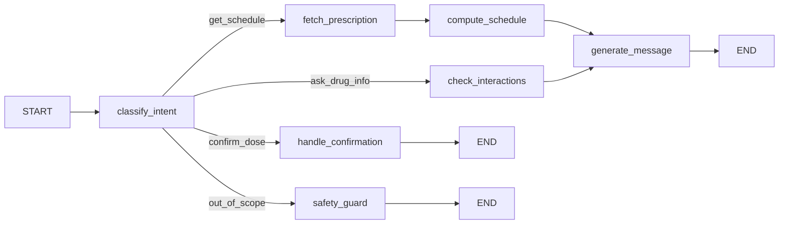

# Phân tích phạm vi phần AI — AI Agent nhắc lịch uống thuốc cá nhân hoá

> Bài toán: AI Agent nhắc lịch uống thuốc cho bệnh nhân, cá nhân hoá dựa trên đơn thuốc
> mà **bác sĩ nhập vào database**. Bạn phụ trách phần AI (LangGraph agent), người còn lại
> phụ trách web-app (UI + có thể cả phần quản trị DB cho bác sĩ nhập đơn).

Repo hiện dùng template AI20K: `src/agents/` (LangGraph) + `src/api/` (FastAPI) +
`src/models/` (Pydantic schema) + `src/services/` (LLM). Phần dưới đây map bài toán
thuốc vào đúng cấu trúc này.

---

## 1. Ranh giới AI ↔ Web-app (chốt trước khi code)

Đây là việc quan trọng nhất cần thống nhất với bạn làm web-app **trước khi viết code**,
vì hai bên chạy song song và phụ thuộc vào contract này.

| Nội dung | Ai sở hữu | AI cần gì từ đó |
|---|---|---|
| Bảng `prescriptions` (đơn thuốc bác sĩ nhập: thuốc, liều, tần suất, thời gian điều trị, ghi chú "trước/sau ăn"...) | Web-app / DB | Đọc qua API hoặc query trực tiếp DB (read-only) |
| Bảng `patients` (giờ ngủ/dậy, giờ ăn, dị ứng, bệnh lý nền, múi giờ) | Web-app / DB | Đọc để cá nhân hoá giờ nhắc |
| Bảng `dose_logs` (đã uống / bỏ lỡ / snooze) | Web-app / DB (hoặc AI ghi) | AI cần **ghi** khi xử lý phản hồi "đã uống" từ chat, web-app cần **đọc** để hiển thị lịch sử |
| Cơ chế gửi thông báo thật (push notification, SMS, email) | Web-app | AI **không** làm phần gửi — AI chỉ tạo nội dung + thời điểm; web-app/scheduler bắn thông báo |
| Lịch trình cron/scheduler (ai gọi AI vào đúng giờ để tạo nhắc nhở) | Cần thống nhất | Có thể do web-app cron gọi `POST /reminders/generate`, hoặc AI expose 1 endpoint để lấy "lịch 24h tới" và web-app tự tính giờ bắn |

**Việc cần làm ngay:** thống nhất 1 schema DB tối thiểu (tên bảng, tên cột) và 1-2 API
contract (request/response JSON) với đồng team, viết vào `ARCHITECTURE.md` hoặc 1 file
`docs/api_contract.md` chung. Không cần chờ web-app code xong — chỉ cần schema thống nhất
là AI có thể mock data và làm độc lập.

---

## 2. Thiết kế AgentState (`src/agents/state.py`)

State hiện tại (`query, context, analysis, response, error, metadata`) là generic chatbot.
Cần mở rộng cho domain thuốc:

```python
class AgentState(TypedDict, total=False):
    patient_id: str
    query: str                     # câu hỏi/tin nhắn từ bệnh nhân (nếu là chat)
    intent: str                    # "get_schedule" | "confirm_dose" | "ask_drug_info" | "reschedule" | ...
    prescriptions: list[dict]      # lấy từ DB qua tool
    patient_profile: dict          # giờ sinh hoạt, dị ứng, bệnh nền
    schedule: list[dict]           # các mốc giờ uống thuốc đã tính, đã cá nhân hoá
    interaction_warnings: list[str]# cảnh báo tương tác thuốc (nếu có RAG/tool tra cứu)
    reminder_message: str          # nội dung nhắc nhở đã cá nhân hoá (giọng văn thân thiện)
    response: str                  # phản hồi cho chat
    error: str
    metadata: dict
```

## 3. Nodes (`src/agents/nodes/`)

Thay `example_node.py` bằng các node theo domain:

1. **`classify_intent_node`** — LLM/rule phân loại tin nhắn: hỏi lịch thuốc, xác nhận đã
   uống, hỏi tác dụng phụ, xin đổi giờ nhắc, hay câu hỏi ngoài phạm vi.
2. **`fetch_prescription_node`** — gọi tool đọc đơn thuốc + hồ sơ bệnh nhân từ DB.
3. **`compute_schedule_node`** — logic lõi: biến `frequency` (VD "3 lần/ngày, sau ăn")
   + giờ sinh hoạt bệnh nhân → các mốc giờ cụ thể (07:00, 12:30, 19:00...). Đây là phần
   **không cần LLM**, nên viết bằng code thuần (deterministic), không giao cho LLM đoán giờ.
4. **`check_interactions_node`** *(nice-to-have)* — tra cứu tương tác thuốc/chống chỉ định
   qua RAG hoặc tool tra dữ liệu thuốc (nếu có time làm).
5. **`generate_message_node`** — LLM viết nội dung nhắc nhở/tư vấn bằng ngôn ngữ tự nhiên,
   thân thiện, đúng tên thuốc/liều lấy từ state (không để LLM tự bịa liều).
6. **`handle_confirmation_node`** — ghi nhận "đã uống" / "bỏ lỡ" vào `dose_logs`.
7. **`safety_guard_node`** — chặn/redirect các câu hỏi vượt phạm vi (chẩn đoán bệnh, đổi
   liều theo yêu cầu bệnh nhân...) → trả lời an toàn, khuyên liên hệ bác sĩ.

## 4. Tools (`src/agents/tools/`)

Thay `example_tool.py` bằng tool thật:

- `get_prescriptions(patient_id) -> list[dict]` — đọc DB (SQLAlchemy hoặc HTTP call sang
  API web-app, tuỳ contract ở mục 1).
- `get_patient_profile(patient_id) -> dict`
- `record_dose_event(patient_id, prescription_id, status, timestamp)`
- `search_drug_info(drug_name) -> str` — nếu làm RAG: tra cứu tương tác/tác dụng phụ từ
  knowledge base (VD nguồn công khai về thuốc, nhúng vào Chroma).
- Bỏ `calculate` (không liên quan bài toán).

## 5. Graph flow (gợi ý, `src/agents/graph.py`)



## 6. API cần expose (`src/api/routes.py`)

> **Cập nhật 2026-08-08**: đồng team đã chốt `api-contract.md` + `schema.md` (21 bảng).
> Thiết kế thực tế **đảo ngược** so với dự kiến ban đầu: AI **không** tự expose endpoint
> public cho web-app/cron gọi vào. Thay vào đó web-app sở hữu endpoint trigger, AI chạy
> như một job nền (async worker) và ghi kết quả vào DB để web-app poll trạng thái.

- Web-app gọi AI qua job trigger, không phải AI expose route cho web-app:
  - `POST /patients/{patient_id}/schedules/generate` (Doctor/System) — trả `202 Accepted` +
    `agent_run_id` ngay lập tức, không đợi AI chạy xong.
  - `POST /patients/{patient_id}/schedules/reschedule` (Patient/System) — tương tự, dùng khi
    bệnh nhân đổi giờ sinh hoạt hoặc bỏ lỡ nhiều cữ.
  - `GET /agent-runs/{agent_run_id}` — web-app poll bằng endpoint này để lấy trạng thái
    (`RUNNING`/`COMPLETED`/`FAILED`), `latency_ms`, `generated_dose_count`, `error_code`.
- **Việc AI cần làm**: khi nhận trigger (`trigger_type`: `PRESCRIPTION_APPROVED` /
  `ROUTINE_UPDATED`), chạy graph (`compute_schedule_node` → `generate_message_node`), rồi
  ghi kết quả vào bảng `agent_runs` (status, `generated_dose_count`, `graph_version`...) và
  `scheduled_doses`. Cần thống nhất với đồng team: AI ghi thẳng vào DB, hay có 1 callback/
  internal endpoint riêng để cập nhật `agent_run` — **chưa chốt, cần hỏi lại**.
- `POST /chat` — vẫn giữ, route qua intent thuốc (bệnh nhân hỏi/xác nhận qua chat). Đây là
  API riêng của AI service, không nằm trong `api-contract.md` (file đó là contract chính
  của web-app, không phải toàn bộ hệ thống).
- Xác nhận uống/bỏ lỡ **không còn là 1 endpoint của AI nữa** — web-app đã có sẵn
  `POST /scheduled-doses/{scheduled_dose_id}/actions` (action: `TAKEN`/`SNOOZE`/`SKIPPED`,
  bắt buộc header `Idempotency-Key`) để app di động gọi trực tiếp. `handle_confirmation_node`
  trong chat (mục 3) giờ chỉ là lối vào phụ (khi bệnh nhân báo qua chat thay vì bấm nút) —
  nếu dùng, AI phải gọi lại đúng endpoint này (kèm Idempotency-Key) thay vì tự ghi thẳng vào
  `adherence_logs`, để tránh 2 nguồn ghi trùng.
- `GET /status` — giữ nguyên, health-check nội bộ của AI service.

## 7. An toàn & giới hạn phạm vi (quan trọng, hay bị BTC/giảng khảo chấm điểm)

- Agent **không chẩn đoán bệnh, không tự đổi liều/loại thuốc** — mọi thay đổi phải đến từ
  bác sĩ nhập vào DB, AI chỉ đọc và nhắc.
- Khi bệnh nhân hỏi ngoài phạm vi (VD tác dụng phụ nghiêm trọng, quá liều) → trả lời có
  disclaimer + khuyên liên hệ cơ sở y tế, không tự tư vấn y khoa sâu.
- Test case an toàn nên có trong `eval/` (câu hỏi "tôi uống gấp đôi liều có sao không" phải
  ra câu trả lời an toàn, không hallucinate).

## 8. Testing & Evaluation

- `tests/test_agents/` — unit test cho `compute_schedule_node` (logic tính giờ là phần dễ
  test nhất và nên có coverage cao vì đây là core logic, không phụ thuộc LLM).
- `eval/` — bộ câu hỏi mẫu đánh giá: độ chính xác giờ nhắc, chất lượng câu trả lời tư vấn,
  tỷ lệ chặn đúng các câu hỏi ngoài phạm vi (safety).

## 9. Checklist thứ tự làm việc

1. [x] Chốt schema DB với đồng team — thực tế ra `api-contract.md` + `schema.md` (21 bảng,
   rộng hơn nhiều so với 3 bảng tối thiểu dự kiến ban đầu).
2. [ ] Viết mock data JSON theo `schema.md` (đặc biệt bảng `prescriptions`,
   `prescription_items`, `patient_routines`, `scheduled_doses`, `agent_runs`) để dev độc lập,
   chưa cần DB thật.
3. [ ] Cập nhật `state.py` theo mục 2 — thêm field khớp `prescription_items` thật
   (`morning_dose`/`noon_dose`/`evening_dose`/`bedtime_dose`, `meal_relation`,
   `minimum_interval_minutes`) thay vì chuỗi `frequency` tự do.
4. [ ] Viết `compute_schedule_node` (thuần code, có unit test) — đây là phần lõi, làm trước.
5. [ ] Viết tool đọc DB (`fetch_prescription_node`), nối vào graph.
6. [ ] Viết `generate_message_node` bằng LLM (prompt cá nhân hoá theo tên bệnh nhân/thuốc).
7. [ ] Viết `safety_guard_node` + test case an toàn trong `eval/`.
8. [ ] Xác nhận với đồng team cơ chế AI ghi kết quả vào `agent_runs`/`scheduled_doses` (ghi
   thẳng DB hay qua callback nội bộ) — xem ghi chú "chưa chốt" ở mục 6.
9. [ ] Xác nhận `handle_confirmation_node` (chat) gọi lại đúng
   `POST /scheduled-doses/{id}/actions` kèm `Idempotency-Key`, không ghi trùng vào
   `adherence_logs`.
10. [ ] (Nice-to-have) RAG tra cứu tương tác thuốc — lưu ý slice 8 đã có sẵn OCR+RAG cho
   nhãn thuốc (`ocr_jobs`), nên hỏi rõ AI có cần dùng chung knowledge base đó không, tránh
   làm trùng.
11. [ ] Cập nhật `ARCHITECTURE.md` phần "3. AI Agent" và `docs/architecture_diagram.md` —
   hiện cả 2 file vẫn là template placeholder, chưa điền theo thiết kế thật.
