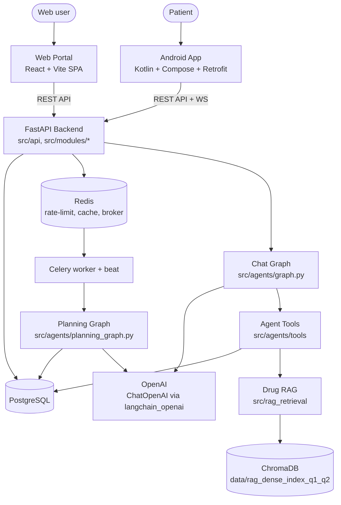
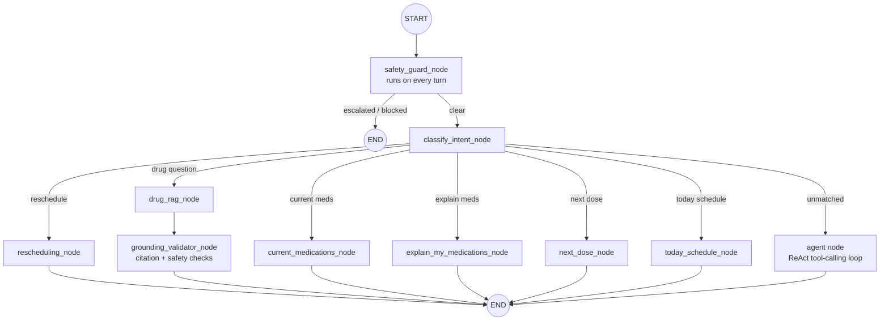

# Architecture Diagram

> Redrawn from the real codebase (2026-08-29) — the previous version was generic
> template content (Next.js frontend, Gemini LLM, no Redis/Celery/Android, a made-up
> "Agent Flow" that didn't match `src/agents/graph.py`). See `docs/structure.md` for the
> file-level directory map this diagram summarizes.

## System Overview

Two separate client apps (Web, Android) talk to the same FastAPI backend — there is no
frontend-specific API. The backend has **two independent LangGraph graphs**: the chat
graph (`/chat`, `/chat/voice`, synchronous request/response) and the planning graph
(schedule generation/reschedule, triggered async via Celery, polled via `agent_runs`).
Only OpenAI is used as an LLM provider — no other vendor is wired into the code.

## Chat Graph Flow (`src/agents/graph.py`)

`safety_guard_node` runs first on **every** turn (not just an `out_of_scope` branch): a
rule-based keyword layer that always wins, plus an LLM classifier (temperature 0, 3s
timeout, fail-open) that can only add escalations, never override a rule-based block. See
`docs/CHATBOT_GUARDRAIL_PLAN.md` for the full 5-layer guardrail design.

## Planning Graph Flow (`src/agents/planning_graph.py`)

```mermaid
graph LR
    START((START)) --> Gate[planning_input_gate_node]
    Gate --> Norm[planning_normalize_node]
    Norm --> Candidate[planning_generate_candidate_node<br/>LLM proposes grouping]
    Candidate --> Lock[planning_lock_and_revalidate_node<br/>pure-code revalidation, no LLM trust]
    Lock --> Group[planning_apply_grouping_node]
    Group --> Persist[planning_persist_node]
    Persist --> Audit[planning_audit_node]
    Audit --> END((END))
```

This is the real "tầng 1/tầng 2" solver pipeline (see `docs/# Kế hoạch build tầng 2 —
Agent layer.md`). The LLM only proposes a dose-time grouping in
`planning_generate_candidate_node`; every candidate is deterministically revalidated in
`planning_lock_and_revalidate_node` against `src/modules/agents/planner.py`'s pure
functions before anything persists — the agent never has unchecked authority over the
final schedule.

## Component Details

| Component | Technology | Purpose |
|-----------|-----------|---------|
| Web frontend | React + Vite SPA (`web/`) | Doctor/patient/admin portal |
| Mobile app | Kotlin + Jetpack Compose + Retrofit (`android/`) | Patient-facing app, offline outbox + sync |
| Backend | FastAPI (`src/api/`, `src/modules/*/router.py`) | REST + WebSocket API server |
| Database | PostgreSQL | Data persistence (async SQLAlchemy 2.0) |
| Cache / broker | Redis | Rate-limiting, dashboard event pub/sub, Celery broker |
| Async jobs | Celery (worker + beat) | Schedule generation/reschedule, missed-dose scans |
| Chat agent | LangGraph (`src/agents/graph.py`) | Patient chat — safety-gated, tool-calling |
| Planning agent | LangGraph (`src/agents/planning_graph.py`) | Deterministic-revalidated schedule computation |
| LLM | OpenAI (`ChatOpenAI`, `src/modules/planning/core/llm.py`) | Only LLM provider wired into the code |
| Vector store | ChromaDB (`data/rag_dense_index_q1_q2/`) | Drug-formulary RAG corpus (~11.6k chunks) |
