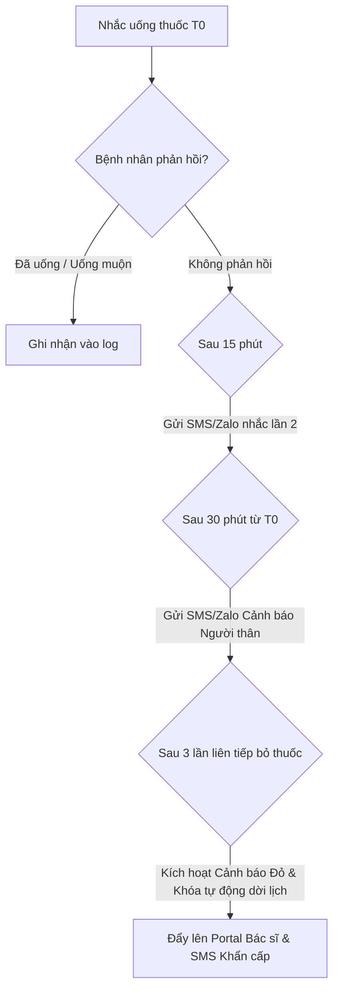

# TÀI LIỆU ĐẶC TẢ NGHIỆP VỤ (SRS) — QUY TẮC LEO THANG CẢNH BÁO (ESCALATION RULES)
## Dự án: AdhereMind — Web-App hỗ trợ tuân thủ điều trị cho người cao tuổi

---

## 1. Giới thiệu chung (Introduction)

### 1.1. Mục tiêu (Purpose)
Tài liệu này đặc tả chi tiết nghiệp vụ phần mềm (SRS) liên quan đến **Quy tắc Leo thang Cảnh báo (Escalation Rules)** và các **Ràng buộc An toàn Y khoa (Medical Safety Guardrails)** của hệ thống AdhereMind. Mục tiêu là định nghĩa rõ các luồng xử lý tự động khi bệnh nhân không tuân thủ lịch uống thuốc, gặp tác dụng phụ nguy hiểm hoặc kích hoạt trạng thái khẩn cấp, nhằm đảm bảo sự can thiệp kịp thời từ người chăm sóc và bác sĩ điều trị.

### 1.2. Phạm vi (Scope)
Tài liệu áp dụng cho việc phát triển các cấu phần:
- Backend API (FastAPI) & Hệ thống hàng đợi tác vụ ngầm (Celery + Redis).
- AI Agent Orchestrator (LangGraph) quản lý trạng thái lập lịch (Planning Agent) và điều chỉnh lịch (Rescheduling Agent).
- Frontend Web-App/PWA dành cho Bệnh nhân, Người chăm sóc và Portal dành cho Bác sĩ.
- Thiết kế cơ sở dữ liệu quan hệ (PostgreSQL).

### 1.3. Định nghĩa & Thuật ngữ viết tắt (Definitions & Abbreviations)
- **Compliance Rate (Tỷ lệ tuân thủ):** Tỷ lệ phần trăm giữa số lần uống thuốc đúng giờ/đúng liều so với tổng số lần được nhắc nhở.
- **Red Alert (Cảnh báo Đỏ):** Trạng thái cảnh báo mức độ cao nhất trên hệ thống, yêu cầu phản hồi ngay lập tức từ người chăm sóc và bác sĩ.
- **Planning Agent:** AI Agent lập lịch uống thuốc ban đầu dựa trên đơn thuốc và giờ sinh hoạt của bệnh nhân.
- **Rescheduling Agent:** AI Agent tự động điều chỉnh lại lịch khi bệnh nhân báo uống muộn hoặc bỏ liều.
- **Caregiver Override (Xác nhận hộ):** Quyền của người chăm sóc xác nhận thay bệnh nhân đã dùng thuốc.
- **PWA (Progressive Web App):** Ứng dụng web có thể cài đặt và chạy offline, hỗ trợ gửi Web Push Notification.

---

## 2. Các đối tượng tác động (System Actors)

| Actor | Mô tả vai trò và quyền hạn đối với Luồng Cảnh báo |
|---|---|
| **Bệnh nhân (Patient)** | Người cao tuổi tiếp nhận nhắc nhở uống thuốc, phản hồi trạng thái uống thuốc, thực hiện khảo sát sức khỏe hàng ngày và kích hoạt nút SOS khẩn cấp. |
| **Người chăm sóc (Caregiver)** | Người thân trực tiếp của bệnh nhân. Nhận tin nhắn cảnh báo (SMS/Zalo) khi bệnh nhân trễ thuốc, bỏ thuốc hoặc gặp biến cố. Có quyền nhấn "Xác nhận hộ" cho bệnh nhân. |
| **Bác sĩ điều trị (Doctor)** | Chuyên gia y tế duyệt đơn thuốc gốc. Theo dõi bảng điều khiển (Dashboard) tỷ lệ tuân thủ của bệnh nhân và tiếp nhận Cảnh báo Đỏ thời gian thực để thực hiện các can thiệp y khoa. |
| **Hệ thống (System / AI Agents)** | Các tác vụ tự động kiểm tra giờ (Cron Jobs), gửi thông báo qua Firebase/SMS/Zalo, và các AI Agent điều phối hành vi của hệ thống theo quy tắc an toàn. |

---

## 3. Đặc tả chi tiết các Kịch bản Leo thang (Detailed Escalation Scenarios)

Hệ thống hoạt động dựa trên sự kết hợp chặt chẽ giữa **Quy tắc Nghiệp vụ Cứng (Hardcoded Rules)** để đảm bảo an toàn y khoa và **AI Agents** để tối ưu hóa lịch trình cá nhân hóa.



### 3.1. Kịch bản 1: Quên/Bỏ thuốc (Medication Non-Adherence)
Khi đến giờ uống thuốc ($T_0$), hệ thống kích hoạt luồng nhắc nhở đa kênh theo các mốc thời gian:

1. **Tại thời điểm $T_0$:**
   - Hệ thống gửi Web Push Notification thông qua Firebase Cloud Messaging (FCM) đến điện thoại/thiết bị của bệnh nhân.
   - Thiết bị phát thông báo bằng âm thanh và tính năng Text-to-Speech đọc to hướng dẫn (ví dụ: *"Đã đến giờ uống 1 viên thuốc huyết áp màu vàng sau ăn"*).
2. **Tại thời điểm $T_0 + 15$ phút (Không phản hồi):**
   - Hệ thống kiểm tra nếu trạng thái trong `adherence_logs` vẫn là `PENDING`.
   - Gửi tin nhắn nhắc nhở lần 2 thông qua kênh Zalo ZNS hoặc SMS (dành cho trường hợp mất kết nối mạng hoặc không tương tác với App).
3. **Tại thời điểm $T_0 + 30$ phút (Không phản hồi):**
   - Hệ thống gửi thông báo cảnh báo mức độ 1 cho Người chăm sóc (Caregiver) qua SMS/Zalo: *"Ông/Bà [Tên bệnh nhân] chưa xác nhận uống thuốc liều [Tên thuốc] lúc [Giờ uống]. Vui lòng kiểm tra."*
4. **Ngưỡng bỏ thuốc liên tiếp (Bỏ thuốc >= 3 lần):**
   - Nếu bệnh nhân ghi nhận trạng thái **[Bỏ qua] (SKIPPED)** hoặc không phản hồi đúng giờ liên tiếp từ 3 liều thuốc trở lên trong đơn thuốc hiện tại:
     - Hệ thống tự động kích hoạt **Cảnh báo Đỏ (Red Alert)**.
     - Gửi tin nhắn khẩn cấp SMS/Zalo đến Người chăm sóc.
     - Gắn cờ cảnh báo màu đỏ nổi bật và đẩy bệnh nhân này lên đầu danh sách giám sát trên Dashboard của Bác sĩ.
     - **Ràng buộc an toàn:** Hệ thống tự động **Khóa chức năng tự điều chỉnh lịch (Rescheduling)** để ngăn AI tự ý thay đổi lịch trình khi bệnh nhân liên tục không tuân thủ nghiêm trọng. Bác sĩ hoặc người chăm sóc phải can thiệp trực tiếp.

---

### 3.2. Kịch bản 2: Lạm dụng hoãn thuốc (Reschedule Limit Guardrails)
Để hỗ trợ cuộc sống linh hoạt của người cao tuổi, hệ thống cho phép dời lịch uống thuốc thông qua **Rescheduling Agent**, nhưng phải tuân thủ các quy tắc an toàn nghiêm ngặt để tránh ngộ độc thuốc:

1. **Giới hạn số lần dời lịch tự động:**
   - Hệ thống chỉ cho phép tự động dời lịch tối đa **2 lần/ngày** đối với mỗi hoạt chất thuốc.
   - Đến lần hoãn thứ 3 liên tiếp trong ngày, hệ thống sẽ **khóa hoàn toàn tính năng tự dời lịch** đối với thuốc đó. Trạng thái liều thuốc sẽ tự động chuyển thành **[Bỏ qua] (SKIPPED)** để tránh uống quá gần liều của ngày tiếp theo.
   - Kích hoạt thông báo cảnh báo gửi đến Người chăm sóc để trực tiếp nhắc nhở.
2. **Quy tắc Khoảng cách tối thiểu giữa hai liều (Min Time Gap Guardrail):**
   - Khi dời lịch ($T_{new} = T_{current} + \Delta t$), Rescheduling Agent bắt buộc phải kiểm tra khoảng cách thời gian với liều kế tiếp ($T_{next}$) của cùng một hoạt chất.
   - Khoảng cách an toàn tối thiểu được cấu hình cứng theo danh mục dược thư (ví dụ: Thuốc huyết áp tối thiểu cách nhau 8 giờ, thuốc kháng sinh cách nhau 6 giờ).
   - Nếu việc dời lịch vi phạm khoảng cách tối thiểu ($T_{next} - T_{new} < \text{Min Time Gap}$):
     - Hệ thống **không cho phép dời lịch** liều hiện tại.
     - Đề xuất bệnh nhân **[Bỏ qua] (SKIPPED)** liều hiện tại và uống liều tiếp theo đúng giờ, hoặc chuyển yêu cầu phê duyệt dời toàn bộ các liều sau tới Bác sĩ/Người chăm sóc.
3. **Quy tắc Không gộp liều (No Double Dosing Guardrail):**
   - > [!IMPORTANT]
     > Trong mọi trường hợp, Rescheduling Agent **nghiêm cấm đề xuất bệnh nhân uống gấp đôi liều lượng** ở lần uống tiếp theo để "bù" cho liều đã bỏ lỡ.
4. **Khung giờ ngủ (Sleep Window Guardrail):**
   - Lịch điều chỉnh mới không được phép rơi vào khung giờ ngủ mặc định của bệnh nhân (thường cấu hình trong `patient_preferences`, ví dụ từ 21:30 đến 07:00 ngày hôm sau), trừ khi có chỉ định đặc biệt từ Bác sĩ được ghi nhận rõ trong đơn thuốc.

---

### 3.3. Kịch bản 3: Tác dụng phụ nguy hiểm (Severe Side Effects)
Hệ thống sử dụng **Daily Health Survey Agent** để khảo sát sức khỏe bệnh nhân hàng ngày bằng giọng nói hoặc bộ câu hỏi trắc nghiệm tối giản.

1. **Phát hiện từ khóa nguy cấp (Critical Symptom Keywords):**
   - Khi bệnh nhân khai báo (bằng giọng nói được AI chuyển thành văn bản hoặc chọn trực tiếp) các triệu chứng thuộc nhóm nguy cơ cao bao gồm: *Khó thở, đau ngực dữ dội, chóng mặt mất thăng bằng, phát ban toàn thân, nhịp tim quá nhanh/chậm*.
2. **Chuỗi hành động leo thang khẩn cấp tự động:**
   - **Bước 1: Hướng dẫn sơ cứu tức thời:** Hiển thị màn hình hướng dẫn sơ cứu khẩn cấp (dạng thẻ lớn, hình ảnh trực quan, chữ to) được lấy từ nguồn Dược thư Quốc gia/Cẩm nang Y tế được kiểm duyệt.
   - **Bước 2: Cảnh báo Người chăm sóc:** Gửi ngay tin nhắn SMS/Zalo khẩn cấp đến Caregiver với nội dung: *"Cảnh báo khẩn cấp: Bệnh nhân [Tên bệnh nhân] khai báo triệu chứng [Triệu chứng] sau khi dùng thuốc. Vui lòng liên hệ ngay lập tức."*
   - **Bước 3: Đẩy cảnh báo thời gian thực lên Portal Bác sĩ:** Gửi cảnh báo đỏ qua WebSocket/SSE lên màn hình Portal của Bác sĩ điều trị kèm thông tin chi tiết các thuốc bệnh nhân vừa uống trong vòng 24 giờ qua.
   - **Bước 4: Nút gọi khẩn cấp:** Hiển thị nổi bật nút gọi nhanh số điện thoại cấp cứu 115 hoặc số hotline của bệnh viện/bác sĩ phụ trách.

---

### 3.4. Kịch bản 4: Nút khẩn cấp SOS (Emergency SOS Button)
Nút SOS được thiết kế hiển thị cố định, kích thước lớn và có màu đỏ đặc trưng ở vị trí dễ thao tác nhất trên màn hình chính của ứng dụng dành cho bệnh nhân.

```
+------------------------------------------+
|  [!] CẢNH BÁO SỨC KHỎE KHẨN CẤP         |
|                                          |
|            /=========\                   |
|           /   S O S   \                  |
|           \  Khẩn Cấp /                  |
|            \=========/                   |
|                                          |
|  * Nhấn giữ 2 giây để kích hoạt          |
+------------------------------------------+
```

1. **Kích hoạt:** Bệnh nhân nhấn và giữ nút SOS trong **2 giây** (để tránh vô tình chạm nhầm).
2. **Quy trình xử lý tức thời:**
   - Hệ thống bỏ qua mọi bước khảo sát, lập tức gửi tin nhắn cảnh báo đỏ đến Người chăm sóc và Bác sĩ điều trị.
   - Thực hiện cuộc gọi tự động hoặc hiển thị giao diện quay số nhanh đến Người chăm sóc.
   - Đẩy cảnh báo khẩn cấp lên đầu hàng đợi hiển thị trên Portal Bác sĩ.

---

### 3.5. Kịch bản 5: Phát hiện hành vi nghi ngờ gian dối (Suspicious Confirmation Detection)
Nhằm đối phó với tình trạng bệnh nhân (hoặc người nhà do quá bận) bấm xác nhận "Đã uống" trên ứng dụng nhưng thực tế không uống thuốc để ứng phó với hệ thống giám sát, AdhereMind áp dụng các quy tắc kiểm tra dấu vết hành vi:

1. **Bấm xác nhận quá nhanh (Latency-based Suspicion):**
   - Nếu bệnh nhân bấm nút **[Đã uống]** trong vòng **dưới 5 giây** kể từ khi thông báo nhắc nhở (Push Notification) xuất hiện trên màn hình.
   - Hệ thống vẫn ghi nhận trạng thái là đã uống, nhưng đồng thời bật cờ nghi ngờ gian dối `is_suspicious = TRUE` và ghi nhận lý do `suspicion_reason = 'CONFIRMED_TOO_FAST'` vào bảng `adherence_logs`.
2. **Xác nhận hàng loạt (Batch Confirmation):**
   - Nếu hệ thống phát hiện có từ 2 liều thuốc trở lên (ở các khung giờ khác nhau) được xác nhận "Đã uống" trong cùng một khoảng thời gian cực ngắn (dưới 10 giây).
   - Hệ thống đánh dấu cờ `is_suspicious = TRUE` và ghi nhận lý do `suspicion_reason = 'BATCH_CONFIRMATION'`.
3. **Hình thức xử lý:**
   - Các bản ghi bị đánh dấu nghi ngờ sẽ được thống kê và hiển thị dưới dạng chỉ số tin cậy trên Dashboard của Bác sĩ.
   - Nếu tỷ lệ bản ghi nghi ngờ vượt quá **30%** tổng số lần uống thuốc trong tuần, hệ thống sẽ gửi ý kiến đề xuất đến Bác sĩ để kiểm tra lại trực tiếp với bệnh nhân trong đợt tái khám.

---

## 4. Quy trình Xử lý Cảnh báo dành cho Bác sĩ (Doctor Alert Resolution)

Khi hệ thống kích hoạt trạng thái **Red Alert** đối với một bệnh nhân, quy trình tiếp nhận và giải quyết cảnh báo trên Portal Bác sĩ được quy định như sau:

1. **Hiển thị Cảnh báo:**
   - Bệnh nhân bị Red Alert sẽ được đưa lên đầu danh sách quản lý của Bác sĩ.
   - Màn hình Portal nhấp nháy đỏ kèm theo tiếng chuông cảnh báo (có thể tắt âm thanh trong cài đặt).
2. **Quy trình Giải quyết (Acknowledge & Resolve):**
   - Bác sĩ bấm vào cảnh báo để xem thông tin chi tiết bao gồm: Tên bệnh nhân, lý do cảnh báo (Bỏ thuốc >= 3 lần, khai báo tác dụng phụ nguy hiểm, hoặc bấm nút SOS), lịch sử dùng thuốc gần nhất và danh mục đơn thuốc hiện tại.
   - Bác sĩ thực hiện hành động liên lạc hoặc xử lý y khoa trực tiếp ngoài đời thực.
   - Sau khi xử lý xong, Bác sĩ bấm nút **[Đóng Cảnh báo] (Resolve Alert)** để đưa trạng thái bệnh nhân trở lại bình thường.
3. **Yêu cầu về ghi chú giải trình (Resolution Note Guardrail):**
   - > [!NOTE]
     > Khi thực hiện đóng cảnh báo, hệ thống hiển thị ô nhập dữ liệu **"Ghi chú hướng dẫn/lý do xử lý y khoa"**. 
     > Để tối ưu hóa thời gian cho Bác sĩ, phần ghi chú này là **KHÔNG BẮT BUỘC (Optional)**. Bác sĩ có thể bấm xác nhận đóng ngay lập tức mà không cần nhập nội dung nếu đang trong tình huống khẩn cấp, hoặc ghi chú bổ sung sau.

---

## 5. Đặc tả Mô hình Dữ liệu liên quan (Data Model Mapping)

Cơ chế cảnh báo leo thang tương tác trực tiếp với các bảng dữ liệu sau trong cơ sở dữ liệu hệ thống:

### 5.1. Bảng `patient_preferences` (Cài đặt kênh nhắc nhở và ngưỡng báo động)
- `preferred_channel`: Kênh ưu tiên nhận thông báo (`PUSH`, `ZALO`, `SMS`).
- `enable_snooze`: Cho phép hoãn báo thức uống thuốc (`TRUE`/`FALSE`).
- `snooze_interval_minutes`: Thời gian giữa các lần nhắc lại (Mặc định: 15 phút).
- `max_snooze_count`: Số lần nhắc tối đa trước khi gửi cảnh báo cấp độ cao hơn (Mặc định: 3 lần).

### 5.2. Bảng `adherence_logs` (Nhật ký tuân thủ & ghi nhận cảnh báo)
Mỗi sự kiện nhắc nhở được giám sát bằng một bản ghi trong bảng này:
- `status`: Trạng thái dùng thuốc (`PENDING`, `TAKEN`, `SKIPPED`, `DELAYED`).
- `escalation_triggered`: Cờ kích hoạt cảnh báo (`TRUE`/`FALSE`). Mặc định là `FALSE`. Chuyển sang `TRUE` khi kích hoạt luồng leo thang cảnh báo.
- `escalation_reason`: Chuỗi văn bản mô tả lý do leo thang (ví dụ: *"Bỏ thuốc 3 lần liên tiếp"*, *"SOS kích hoạt từ bệnh nhân"*, *"Tác dụng phụ: Khó thở"*).
- `is_suspicious`: Cờ nghi ngờ gian dối (`TRUE`/`FALSE`).
- `suspicion_reason`: Lý do nghi ngờ (`CONFIRMED_TOO_FAST`, `BATCH_CONFIRMATION`).
- `confirmation_latency_seconds`: Khoảng thời gian từ lúc nhận thông báo đến lúc bấm nút (giây).

### 5.3. Bảng `notifications` (Nhật ký gửi tin nhắn leo thang)
Lưu vết các tin nhắn nhắc nhở và tin nhắn khẩn cấp được gửi đi:
- `channel`: Kênh gửi tin nhắn (`PUSH`, `SMS`, `ZALO`, `EMAIL`).
- `status`: Trạng thái gửi (`PENDING`, `SENT`, `FAILED`, `CANCELLED`).
- `error_message`: Chi tiết lỗi nếu không gửi được tin nhắn để đội ngũ kỹ thuật xử lý.

---

## 6. Chỉ số KPI & Yêu cầu phi chức năng (KPIs & Non-functional Requirements)

### 6.1. Thời gian trễ tối đa (Latency KPIs)
- **Cảnh báo SOS / Tác dụng phụ:** Thời gian từ lúc bệnh nhân nhấn nút SOS hoặc khai báo triệu chứng nguy cấp đến khi cảnh báo xuất hiện trên Portal Bác sĩ và tin nhắn khẩn cấp gửi đi phải **dưới 10 giây**.
- **Cảnh báo trễ giờ uống thuốc:** SMS/Zalo cảnh báo người thân phải được gửi đi chính xác trong vòng **dưới 1 phút** sau khi hết thời gian chờ phản hồi ($T_0 + 30$ phút).

### 6.2. Độ chính xác cảnh báo (Red Alert Accuracy KPI)
- Tỷ lệ cảnh báo đúng thực tế phải đạt **từ 90% trở lên** (số lần cảnh báo đỏ có sự can thiệp y khoa hoặc người thân xác nhận có vấn đề thực tế / tổng số cảnh báo đỏ phát ra từ hệ thống), nhằm tránh gây ra hội chứng "nhờn cảnh báo" (Alert Fatigue) cho Bác sĩ và Người chăm sóc.

### 6.3. Khả năng hoạt động Ngoại tuyến (Offline-First Requirement)
- Ứng dụng dành cho bệnh nhân phải sử dụng **Service Workers (PWA)** để lưu trữ cục bộ lịch uống thuốc trong ngày.
- Khi mất kết nối internet, PWA vẫn tự đổ chuông báo thức đúng giờ uống thuốc trên thiết bị.
- Trạng thái uống thuốc được lưu tạm thời dưới LocalStorage/IndexedDB và tự động đồng bộ hóa (Sync) lên Server ngay khi thiết bị có kết nối mạng trở lại.
