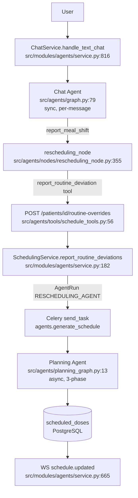
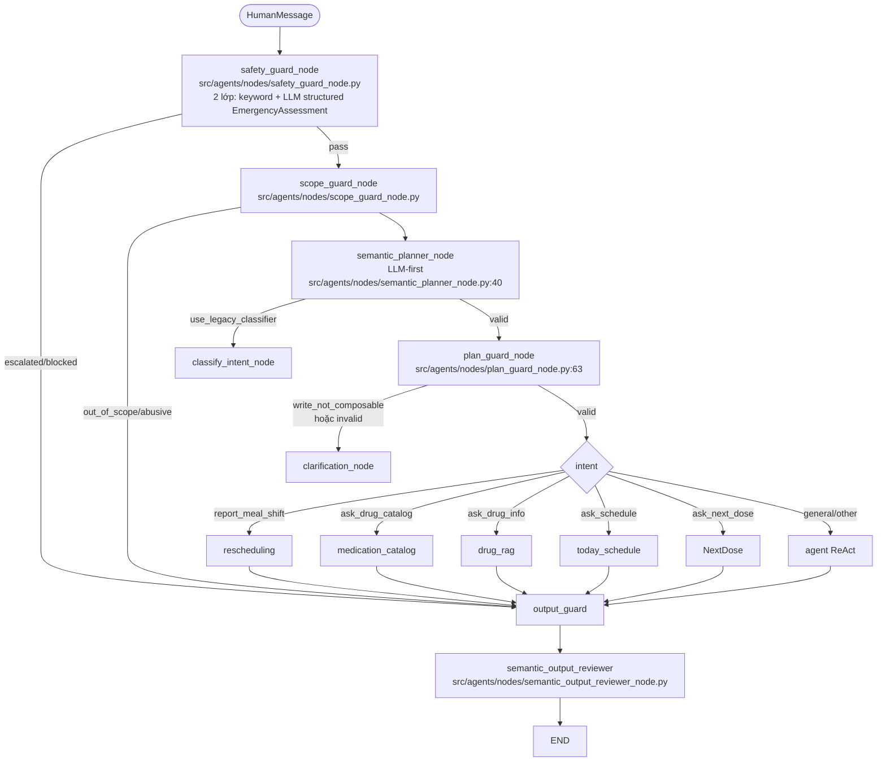
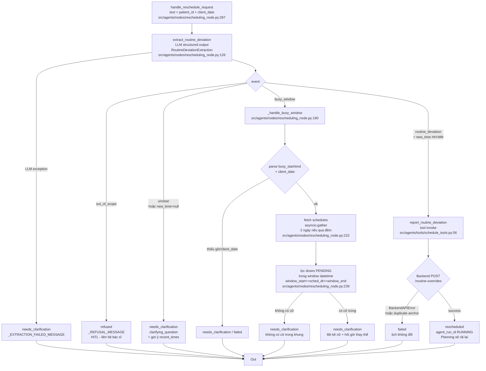
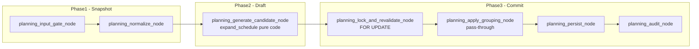
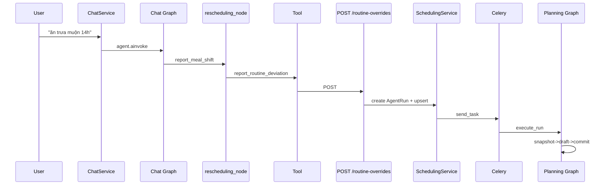

# Luồng hoạt động Chatbot ↔ Planning Agent — Rescheduling

> Nguồn: `src/agents/graph.py`, `src/agents/nodes/rescheduling_node.py`, `src/agents/nodes/semantic_planner_node.py`, `src/agents/nodes/scope_guard_node.py`, `src/modules/agents/service.py`, `src/modules/agents/planner.py`, `src/agents/planning_graph.py`
> Cập nhật: 2026-09-02 — sync với develop (thêm `medication_catalog`, `semantic_output_reviewer`), pure-rule (đã bỏ LLM grouping)

---

## 1. Tổng quan — Hai graph tách biệt

- **Chat Graph** sync, trả lời ngay; **Planning Graph** async qua Celery, poll `GET /agent-runs/{id}`.

---

## 2. Chat Graph — Điều hướng intent (sau merge develop)

- `develop` thêm `medication_catalog` và `semantic_output_reviewer` (review output sau `output_guard`).
- `plan_guard` hiện chặn `write_not_composable` (fix bug #3).

---

## 3. Rescheduling Node — 4 nhánh kết quả

### Schema `RoutineDeviationExtraction`

| field | type | ví dụ |
|-------|------|-------|
| `event` | `routine_deviation\|busy_window\|unclear\|out_of_scope` | `routine_deviation` |
| `anchor` | `breakfast/lunch/dinner/sleep\|null` | `lunch` |
| `new_time` | `HH:MM\|null` | `14:00` |
| `busy_start/end` | `HH:MM` | `14:00 / 17:00` |
| `target_day` | `today/tomorrow/day_after_tomorrow\|null` | `tomorrow` |
| `clarifying_question` | `string\|null` | `Bạn ăn trưa lúc mấy giờ?` |

Giới hạn `target_day` chỉ `0..2` (`_DAY_OFFSETS`); `3-4 hôm sau` -> `unclear`.

---

## 4. Planning Agent — 3-phase (pure-rule)

- `expand_schedule()` `src/modules/agents/planner.py:399`: 4 slot `morning->breakfast` ...
- Validators -> Fail => `NEEDS_REVIEW`

---

## 5. Bảng Case

### 5.1 Rescheduling (chat)

| # | Câu | Extract | Kết quả |
|---|-----|---------|---------|
| C1 | `Hôm nay ăn trưa muộn, dời qua 14h` | `lunch 14:00 today` | `rescheduled` |
| C2 | `Tôi ăn muộn` | `unclear lunch` | `needs_clarification` + gợi ý recent_times |
| C3 | `Tối nay 22h-2h bận họp` | `busy_window 22:00-02:00` | `needs_clarification` (gather 2 ngày, window datetime) |
| C4 | `Chiều 14h-17h bận` không có cữ | `busy_window` | `không có cữ` |
| C5 | `Bỏ cữ tối` / `tăng liều` | `out_of_scope` | `refused` |
| C6 | `Lùi thuốc này 9h30` | `out_of_scope` (không anchor) | `refused` — phải nói `ăn sáng/trưa/tối/ngủ` |
| C7 | `Ngày kia ăn sáng 9h30` | `breakfast 09:30 day_after_tomorrow` | `rescheduled` |
| C8 | `3 hôm sau bận` | `unclear` (ngoài 0..2) | `needs_clarification` |
| C9 | LLM timeout | exception | `needs_clarification` |
| C10 | `409 run in progress` | `routine_deviation` hợp lệ | `failed` |

### 5.2 Scope guard (mới)

| Câu | Whitelist | Kết quả |
|-----|-----------|---------|
| `h t mới ăn tối xong` | `an toi xong` thiếu `muon` -> `out_of_scope` LLM | `Mình chỉ hỗ trợ về thuốc...` `src/agents/nodes/scope_guard_node.py:17` |
| `ăn tối muộn 20h30` | `an toi muon` -> `medication` | pass -> rescheduling |

---

## 6. Sequence — C1 thành công

